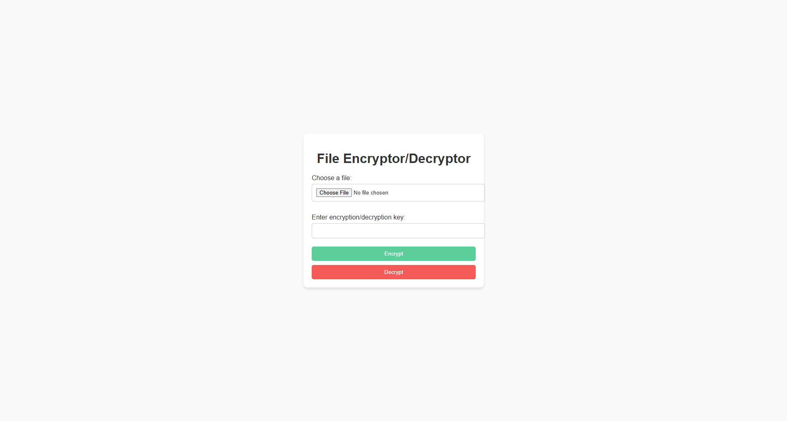
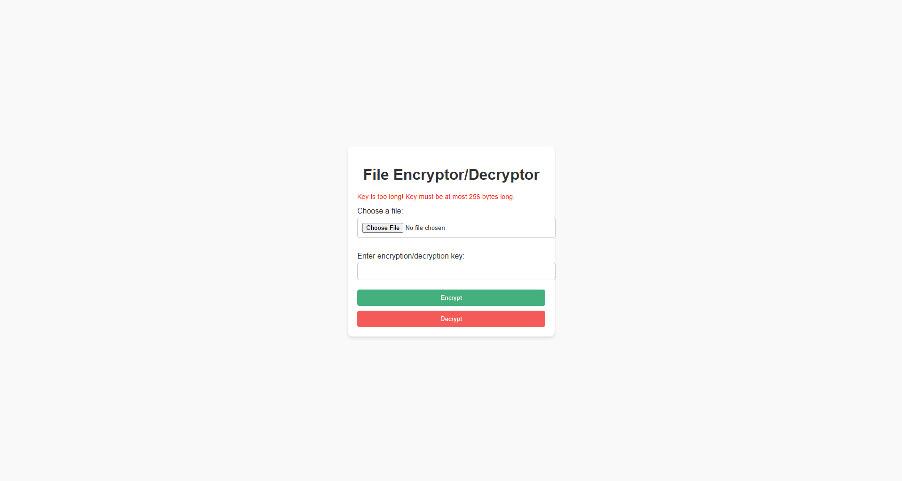
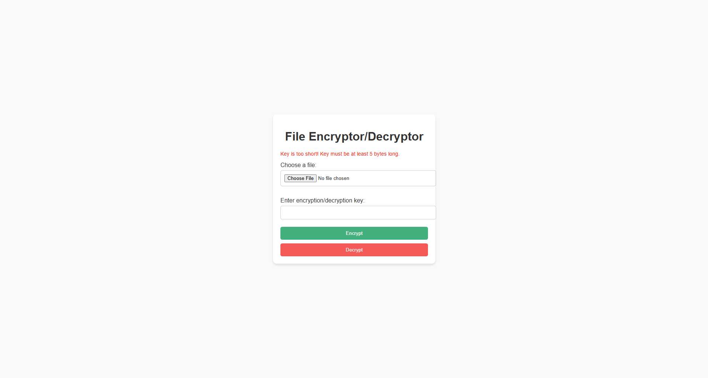

# File Encryptor/Decryptor

## Introduction
This mini project is a web application built with Flask that allows users to encrypt and decrypt files using RC4 encryption. It ensures secure file encryption and decryption while providing a user-friendly interface.

## Features
- **File Upload**: Users can upload files for encryption or decryption.
- **RC4 Encryption**: Utilizes RC4 for lightweight and fast encryption.
- **Custom Key Input**: Users can provide their own encryption/decryption key.
- **Error Handling**: Displays meaningful messages when decryption fails due to incorrect keys.
- **Responsive UI**: Buttons styled with pastel colors for better usability.

## Understanding RC4
### What is RC4?
RC4 (**Rivest Cipher 4**) is a symmetric stream cipher widely used for secure data encryption. Unlike block ciphers such as AES, RC4 processes data byte-by-byte, making it lightweight and fast. However, RC4 is considered insecure for modern applications due to several vulnerabilities, so this project is intended for learning purposes only.

### Key Lengths
RC4 supports variable key lengths, typically ranging from 5 to 256 bytes:
- **Minimum Key Length**: 5 bytes (40 bits).
- **Maximum Key Length**: 256 bytes (2048 bits).
- **Recommended Key Length**: At least 16 bytes (128 bits) for better security.

### Protecting Against Invalid Keys
RC4 does not inherently validate keys, so:
- A minimum key length of 5 bytes is enforced in this project.
- If the key is shorter than 5 bytes, the application will reject it.

## Technologies Used
- **Backend**: Python, Flask
- **Frontend**: HTML, CSS
- **Encryption Logic**: RC4 implemented in Python

## Requirements
- Python 3.8 or higher
- Virtual environment (`venv`) support

## Installation and Setup
1. Clone this repository:
   ```bash
   git clone <repository-url>
   cd <repository-directory>
   ```

2. Create and activate a virtual environment:
   ```bash
   python -m venv .venv
   .\.venv\Scripts\activate
   ```

3. Upgrade `pip`:
   ```bash
   python -m pip install --upgrade pip
   ```

4. Install dependencies:
   ```bash
   pip install -r requirements.txt
   ```

5. Run the application:
   ```bash
   python app.py
   ```

6. Open your browser and visit:
   ```
   http://127.0.0.1:8000/
   ```

## Usage
### Encrypting Files
1. Upload a file using the "Choose File" button.
2. Enter a key (at least 5 bytes long, recommended 16 bytes).
3. Click the green "Encrypt" button.
4. Download the encrypted file.

### Decrypting Files
1. Upload an encrypted file using the "Choose File" button.
2. Enter the same key used for encryption.
3. Click the red "Decrypt" button.
4. Download the decrypted file.

### Notes on Key Usage
- The key length must be at least 5 bytes.
- If the key is incorrect during decryption, the application will display an error message.

## Project Structure
```
project/
├── app.py              # Main Flask application
├── encryptor.py        # File encryption logic
├── decryptor.py        # File decryption logic
├── utils.py            # Utility functions (RC4 implementation and helpers)
├── requirements.txt    # Project dependencies
├── static/             # Static files (CSS, images, etc.)
│   └── style.css       # CSS for styling the UI
└── templates/          # HTML templates
    └── index.html      # Main UI template
```

## Screenshots
### Encryption/Decryption Interface
- Simple UI Testing 

- Invalid Key Too Long

- Invalid Key Too Short


## License
This project is licensed under the MIT License for non-commercial use. See the [LICENSE](LICENSE) file for more details.

## Contribution
Feel free to fork this repository, submit issues, or contribute to the project by creating pull requests.

## Contact
For questions or feedback, please reach out to:
- **Author**: Wadagraprana
- **GitHub**: [Wadagraprana](https://github.com/Wadagraprana)